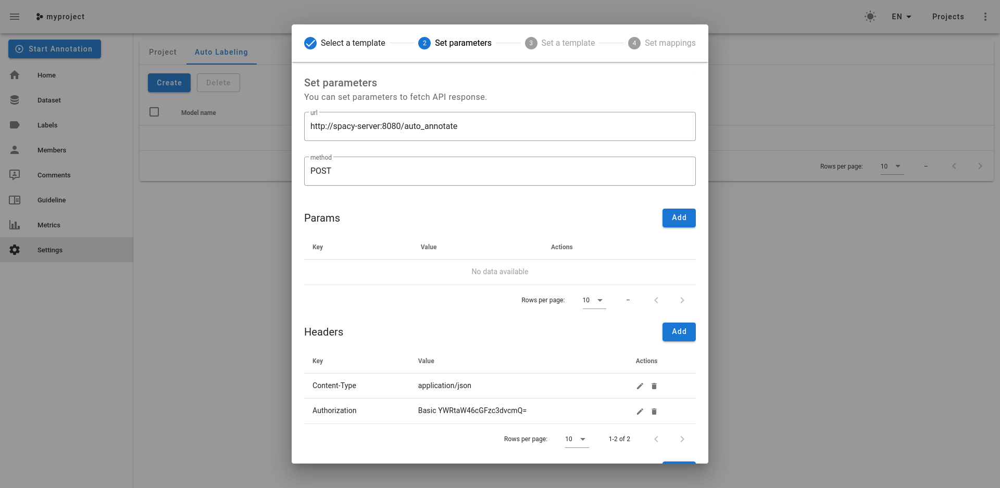

# Doccano annotation server with spacy backend

``` bash
fiete@ubu:~/Documents/programming/spacy/doccano_spacy$ tree -L 2
.
├── custom-model                # contains the spacy model (training) files
│   ├── model-best              # trained model (best)
│   ├── model-last              # trained model (last)
│   ├── base_config.cfg
│   ├── config.cfg
│   └── train.spacy
├── data                        # contains the source data
│   ├── exported
│   ├── captum.csv
│   ├── captum.txt
│   └── doccano_export.zip
├── spacy-server                # spacy backend server
│   ├── app
│   ├── model-best
│   └── Dockerfile
├── convert.py                  # convert reports csv to doccano format
├── docker-compose.yaml
├── exporter.py                 # contains helper functions
├── generate_train_file.py      # generate data file used for training spacy
└── README.md

9 directories, 13 files
```

## Getting started
In order to start annotating, convert the csv file into the format doccano requires for imports.
``` bash
python convert.py
```
Note that this requires the spacy `en_core_web_md` model, which can be obtained by running `python -m spacy download en_core_web_md`.

### Training a custom model

### Spinning up the server
``` bash
docker-compose up -d
```
Shut down:
``` bash
docker-compose stop
```

## Configure Doccano
### Import Dataset

### Create Labels
You can create labels in the labels section (sidemenu).


### Enable Auto Labeling
Important: Make sure you have created your custom labels before setting this up!

#### Select a template
Navigate to Settings and select the Auto Labeling tab. Hit `Create` and select `Custom REST template`.

#### Set parameters
In the next step, we are specifying the request properties.



#### Set a template
Here we can customize the mapping between the response we get from the annotation backend (in this case the spacy server) and doccano. For the mapping Jinja2 is used.


#### Set mappings
Finally we have to provide the mapping between the labels returned by the spacy backend and the ones present in doccano. It looks like we have to provide this even in the case that they are identical.
